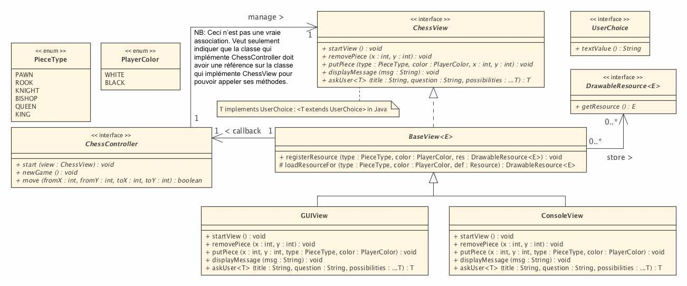
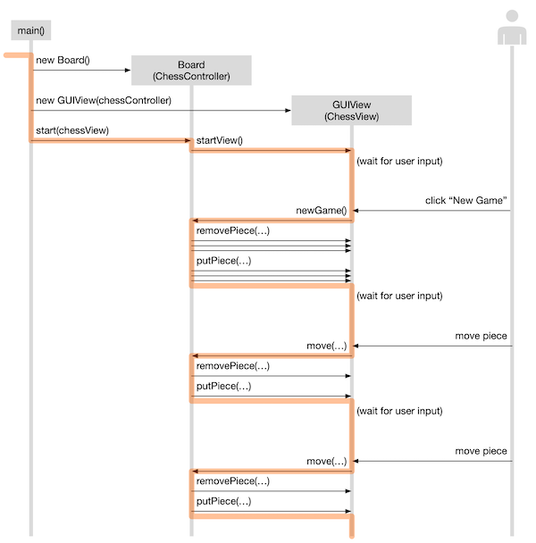

# Laboratoire 08 - Jeu d'échec

Durée du laboratoire: 12 périodes
Il y a un rendu intermédiaire après 4 périodes: votre modélisation UML

## Objectifs
Le but de ce laboratoire est d’implémenter un jeu d’échecs fonctionnel. Une interface
graphique ainsi qu’un mode console vous sont fournis. Vous trouverez une bonne description
des détails des règles du jeu dans l’article [Wikipedia Rules of chess](https://en.wikipedia.org/wiki/Rules_of_chess) . 

Les règles à implémenter sont les suivantes :
- Les mouvements et les prises de toutes les pièces (pions, tours, cavaliers, fous, dames,
rois).
- Le **petit et le grand roque** _(castling short and castling long)_ doivent être fonctionnels.
Leur mouvement est initié en bougeant le roi de deux cases vers la droite ou vers la
gauche. Ce coup ne peut être effectué si le roi est en échec, s’il a déjà bougé, si la tour
concernée a déjà bougée ou si une des cases sur lesquelles le roi passe est en échec.
- La **prise en passant** _(en passant)_ doit être fonctionnelle. Ce coup s’effectue en prenant
un pion ayant avancé de deux cases au tour précédent comme s’il n’avait avancé que
d’une case.
- La **promotion de pions** _(pawn promotion)_ doit être implémentée. Les types de
promotions possibles sont tour, cavalier, fou et dame.
Si un roi est mis en _échec_, le message “Check!” doit être affiché sur la vue (en utilisant sa
méthode `displayMessage(String))`.
- Il n’est pas nécessaire de détecter l’échec et mat ni les différents match nuls.


**Points bonus:**<br/>
Implémentation de la détection de l’ échec et mat et des matchs nuls par pat ou
impossibilité de mater.


## Non-objectifs
- L’utilisateur ne pourra pas jouer contre le programme. L’utilisateur doit bouger les pièces
  des deux côtés.
- Le programme ne propose pas de mouvements ni indique les mouvements possibles.
  <br/>C’est l’utilisateur qui propose les mouvements.

## Implémentation
Les classes et interfaces suivantes sont fournies et ne doivent pas être modifiés (voir archive
chess-starter.zip) :
- `PieceType` est une enum listant les différents types de pièces.
- `PlayerColor` est une enum listant les couleurs des joueurs (blanc, noir).
- `ChessView` est une interface permettant de représenter une interface graphique ou **vue**.
  Nous vous fournissons l’implémentation de deux vues : la vue mode graphique GUIView
  et la vue mode texte ConsoleView. Tout le code de ces vues se trouve dans les packages
  views et assets.
- `ChessController` est une interface permettant de contrôler le jeu d’échecs depuis la
  vue. Il s’agit de l’interface que vous devez implémenter dans le contrôleur.

Nous vous conseillons de mettre toutes les classes nécessaires au contrôleur dans un package
engine.

Pour utiliser le code fourni, votre fonction main() (mettez-la dans une classe Main) doit
ressembler à ça :
```
public static void main(String [] args) {
// 1. Création du contrôleur pour gérer le jeu d’échecs
ChessController controller = new ...;
// Ici, vous devez
instancier un ChessController
// 2. Création de la vue désirée
ChessView view = new GUIView(controller) ;
// mode GUI
//ChessView view = new ConsoleView(controller) ; // ou mode Console
// 3 . Lancement du programme
controller.start (view) ;
}
```
Attention à l’encapsulation et l’aspect OO de votre modélisation

## Conseils d'implémentation

- Pas besoin de regarder `BaseView<E>`, `GUIView` et `ConsoleView`. Il suffit d’utiliser les
méthodes de l’interface `ChessView` pour contrôler l’interface graphique.
- Le type enum `PlayerColor` peut être utilisé sans autres.
- Le type enum `PieceType` peut être utilisé sans autres… mais doit servir uniquement à
être passé à l’interface graphique.
- Le type enum `PieceType` ne doit pas être utilisé pour implémenter les règles et les
déplacements du jeu (on ne veut pas des tests à coup de comparaisons de types !)
- Ne rien coder dans le package fourni (package _chess_). Faire un nouveau package (nous
recommandons `engine`) pour le code que vous créez.

## Schéma UML incomplet


## Diagramme de séquence explicatif

